# FILMHIVE

**FilmHive** is a full-stack web application for film enthusiasts to discover, review, and organise movies.  
The platform is designed to be usable **without authentication** for browsing and discovery, while offering **enhanced, personalised features** to logged-in users such as favourites, watchlists, reviews, likes, follows, and **Blend Mode** (blended film recommendations).


🔗 **Live site:** https://filmhive-85b95f07d5b8.herokuapp.com/  
🔗 **Frontend repository:** https://github.com/Kerem-Haeger/filmhive_frontend  

---

## Project Overview

### Purpose

FilmHive aims to solve a common problem for film lovers:  
**discovering films efficiently and deciding what to watch**, both individually and together.

The project balances:
- Rich film discovery
- Community-driven reviews
- Personal organisation tools  
while remaining **simple, fast, and approachable** for casual users.

Several design decisions were made to **balance feature richness with maintainability, performance, and assessment scope**, ensuring the project remains realistic, coherent, and extensible.

---

## Core Features

### Public Features (No Login Required)

- Browse films in a responsive grid
- Search films by title
- Filter films by genre and year
- View detailed film pages
- Read community reviews and ratings

### Authenticated Features

- User registration, login, and logout (JWT-based)
- Rate and review films (1–10 scale)
- Edit or delete own reviews
- Like helpful reviews
- Favourite / unfavourite films
- Create and manage named watchlists
- Follow other users
- **Blend Mode** (blended recommendations)

### Who Uses FilmHive?

- **Film Enthusiasts** - Casual viewers and serious cinephiles discovering and discussing movies
- **Friends & Couples** - Anyone looking for film recommendations or trying to find a movie both will enjoy
- **Review Readers** - Users seeking community perspectives before watching a film
- **Watchlist Organizers** - Those who like to plan and organize their viewing queue

### Philosophy

FilmHive is built on the principle of community and accessibility:

- **Free to Use** - No paywalls or premium tiers. Everyone has equal access to all features.
- **Community-Driven** - The value comes from shared reviews, ratings, and recommendations from real users.
- **Simple & Fast** - Focus on getting you to films and reviews quickly without unnecessary complexity.
- **Open & Welcoming** - A platform for all film lovers, regardless of taste or experience level.

---

## User Stories

| **ID** | **User Story** | **Acceptance Criteria** |
|-|-|-|
| 1 | As a movie fan, I want to see a list of films with key info, so that I can quickly spot something interesting to watch. | • When I visit /films, I see a grid/list of films from /api/films/. <br> • Each film card shows poster, title, year, and average_rating (or "No ratings yet"). <br> • If the API is loading, a spinner/skeleton is shown. <br> • If the API fails, an error message is shown with a retry option. |
| 2 | As a movie fan, I want to search and filter films, so that I can easily find films matching what I'm in the mood for. | • A search box lets me search films by title (calls /api/films/?search= or similar). <br> • I can filter by at least genre and year using dropdowns/controls. <br> • Applying filters updates the list without a full page reload. <br> • Clearing filters returns me to the default film list. <br> • URL or component state reflects current filters (so navigation feels consistent). |
| 3 | As a movie fan, I want a film detail page, so that I can see full information before deciding to watch it. | • When I click a film card, I'm taken to /films/:id. <br> • The page fetches /api/films/{id} and shows: title, year, overview, poster, runtime, genres, keywords, people, average_rating, review_count. <br> • If the film is not found (404), I see a friendly "Film not found" message and a link back to the films list. <br> • The page is readable and usable on mobile, tablet, and desktop. |
| 4 | As a new user, I want to create an account, so that I can save favourites, watchlists, and reviews. | • A Register page has a form with at least username, email (optional), password, confirm password. <br> • Client-side validation checks required fields and basic password rules. <br> • On submit, the frontend calls the backend auth/registration endpoint. <br> • On success, I'm either logged in automatically or redirected to the login page with a success message. <br> • On validation error (e.g. username taken), inline error messages are shown. |
| 5 | As a returning user, I want to log in and out, so that my personal data is secure and tied to my account. | • A Login page accepts username/email and password. <br> • Successful login stores the JWT/session in a secure place. <br> • The navigation bar clearly indicates when I'm logged in (e.g. "Hi, username" and a logout button). <br> • Logout clears stored auth data and returns me to a public page. <br> • Auth-only buttons (favourite, watchlist, review) are hidden or disabled when logged out. |
| 6 | As a user, I want to always know if I'm logged in, so that I understand what actions I can perform. | • The navbar shows different options depending on login state (e.g. Login/Register vs Profile/Logout). <br> • If my token/session is invalid or expired, I am logged out gracefully and shown a message. <br> • Protected pages redirect to login (or show a message) if I'm not authenticated. |
| 7 | As a logged-in user, I want to rate and review a film, so that I can share my opinion with others. | • On /films/:id, logged-in users see a Review form with rating (1–10) and text fields. <br> • Validation: rating is required and within 1–10, text has a sensible max length. <br> • On submit, the frontend calls the reviews API to create/update the review for that film. <br> • The backend enforces one review per user per film; if a review already exists, the form loads existing data for editing. <br> • On success, the review list and film's average_rating/review_count update without a full page refresh. <br> • On error (validation / server), an inline message is shown. |
| 8 | As a logged-in user, I want to edit or delete my review, so that I can correct or remove it later. | • In the review list, my own review is clearly marked and shows Edit and Delete options. <br> • Edit opens the same review form prefilled with existing content. <br> • Delete asks for confirmation (e.g. simple modal/confirm dialog). <br> • After edit or delete succeeds, the film's review list and aggregate rating are updated. <br> • I cannot edit or delete other users' reviews (no buttons shown and protected by backend permissions). |
| 9 | As a logged-in user, I want to like helpful reviews, so that the best opinions are surfaced. | • Every review (except my own) shows a Like button and like count. <br> • Clicking like sends a request to the review-like API (toggle behaviour). <br> • Liking again unlikes the review. <br> • The like count updates immediately after success. <br> • If I'm logged out and click like, I'm prompted to log in (or shown a message). |
| 10 | As a logged-in user, I want to report harmful or inappropriate reviews, so that moderators can act on them. | • Each review has a Report button or menu option. <br> • Clicking it sends a request to the report endpoint. <br> • A success message confirms the report was submitted. <br> • A reported review will not show up for me anymore. |
| 11 | As a logged-in user, I want to favourite/unfavourite films, so that I can maintain a quick access list of my top picks. | • On film cards and the film detail page, I see a favourite toggle (icon/button) when logged in. <br> • The initial state uses is_favourited from /api/films/ to show on/off. <br> • Clicking it calls the favourites API (create or delete) and immediately updates the icon state. <br> • My favourites are only visible/linked to my account. <br> • If the API fails, an error message is shown and the UI reverts to the previous state. |
| 12 | As a logged-in user, I want a dedicated favourites page, so that I can quickly find films I've marked as favourites. | • A Favourites page lists my favourited films using the same FilmCard component. <br> • List is loaded from a favourites or films endpoint filtered by the current user. <br> • Clicking a card navigates to the film detail page. <br> • If I have no favourites, a friendly empty-state message is shown with a call to action (e.g. "Browse films to start favouriting"). |
| 13 | As a logged-in user, I want to add films to named watchlists, so that I can organise what to watch next (e.g. "Date Night", "Halloween"). | • On a film detail page, I see a "Add to watchlist" control (e.g. button + dropdown). <br> • I can pick from my existing lists (e.g. "Watchlist", "Halloween Picks") or create a new list name in a small form. <br> • The request uses the watchlists API and respects the unique constraint (user_id, name, film_id) (no duplicates in the same list). <br> • On success, I see confirmation (toast/inline message). <br> • If I'm not logged in, I'm asked to log in instead. |
| 14 | As a logged-in user, I want to see and manage my watchlists, so that I can keep them tidy and up to date. | • A Watchlists or Profile page shows all my lists grouped by list name. <br> • Within each list, I see FilmCards for each film. <br> • I can remove a film from a list. <br> • Optionally, I can rename or delete entire lists. <br> • UI stays in sync after operations. |
| 15 | As a logged-in user, I want to select two films and get blended recommendations, so that my partner/friend/... and I can find a compromise film. | • A "Blend Mode" page lets me pick Film A and Film B (e.g. search/autocomplete fields). <br> • Submitting calls /api/blend/?film_a=&film_b=. <br> • The API returns up to 5 recommended films; these are shown as FilmCards with a short "fit score". <br> • If no matches are found, a clear message is shown. <br> • Only logged-in users can access this page or submit the form. |
| 16 | As a user, I want clear loading and error feedback, so that I understand what the app is doing. | • Major data-fetching areas (film list, film detail, profile) show visible loading indicators. <br> • Network/API errors display user-friendly messages. <br> • Retry actions are available where appropriate (e.g. "Try again" button). <br> • Validation errors on forms are shown next to the relevant fields. |
| 17 | As a user, I want the app to be responsive and accessible, so that I can use it comfortably on different devices. | • Key pages (home/films list, film detail, login/register, profile) are usable on mobile, tablet, and desktop. <br> • Interactive elements (buttons, inputs) are keyboard-focusable and have visible focus states. <br> • Images include meaningful alt text where relevant. <br> • Colour contrast is sufficient for text and important UI elements. |

## Features

### Core Features (listed)

#### 🎬 Film Discovery & Browsing
- **Films Page** - Browse a comprehensive list of films in a responsive grid layout
- **Search Functionality** - Search films by title with real-time filtering
- **Advanced Filters** - Filter by genre and year to find exactly what you're looking for
- **Sort Controls** - Sort films by title, year, rating, or popularity
- **Infinite Scroll** - Seamlessly load more films as you browse
- **Film Cards** - Each film card displays poster, title, year, and average rating

#### 📖 Film Details
- **Film Detail Page** - Click any film to see comprehensive information including:
  - Poster image, title, year, genres, runtime, user rating
  - Plot overview and synopsis
  - Cast and crew information
  - Community average rating and review count
- **Mobile-Responsive Design** - Readable and usable on all device sizes

#### ⭐ Reviews & Ratings
- **Write Reviews** - Logged-in users can rate films (1-10) and write detailed reviews
- **Read Reviews** - Browse community reviews on film detail pages
- **Edit/Delete Reviews** - Modify or remove your own reviews
- **Like Reviews** - Mark helpful reviews with a like button
- **Report Reviews** - Flag inappropriate or harmful reviews, which will no longer show up in this authenticated user's reviews section

#### ❤️ Favorites Management
- **Add to Favorites** - Quick-save your favorite films from film cards or detail pages
- **Favorites Page** - Dedicated page showing all your favorited films
- **Favorite Toggle** - Visual indicator shows which films you've favorited
- **Quick Access** - Easy removal of films from favorites

#### 📋 Watchlist Organization
- **Create Watchlists** - Create multiple named watchlists (e.g., "To Watch", "Date Night", "Halloween")
- **Add to Watchlists** - Add films to one or multiple watchlists from detail pages
- **Watchlists Page** - View and manage all your watchlists in one place
- **Remove Films** - Remove individual films from watchlists

#### 🎭 Blend Mode (Unique Feature)
- **Compromise Film Finder** - Select two films and get recommendations that match both preferences
- **Smart Algorithm** - Analyzes film characteristics to find compatible matches
- **Result Cards** - See recommended films with fit scores indicating compatibility
- **Easy Selection** - Search and select films from the database
- **Only for Logged-in Users** - Personalized recommendations for authenticated users

#### 🔐 Authentication & User Management
- **Register** - Create an account with username, email (optional), and password
- **Login** - Secure login with username/email and password
- **Log Out** - Safely log out and clear session
- **Session Management** - Stay logged in across page refreshes with JWT authentication
- **Protected Routes** - Auth-only features are hidden/disabled for logged-out users
- **Clear Auth Status** - Navbar clearly shows login state

#### 🎯 Recommendations (For You)
- **For You Page** - Personalized film recommendations based on your activity
- **Smart Suggestions** - Recommendations based on your favorite films and ratings
- **Discovery** - Find new films aligned with your taste

#### 💬 Notifications & Feedback
- **Toast Notifications** - Real-time feedback for user actions
- **Success Messages** - Confirmation when films are favorited, reviews posted, etc.
- **Error Messages** - Clear, user-friendly error handling
- **Auto-dismiss** - Notifications automatically clear after appropriate time

#### 🎨 Navigation & UX
- **Main Navigation Bar** - Access all key pages (Films, Favorites, Watchlists, Blend Mode, For You)
- **Responsive Design** - Mobile-friendly navigation with toggle menu
- **Hover Effects** - Interactive feedback on buttons and links
- **Home Page** - Welcome page with clear call-to-action for new users
- **Smooth Navigation** - Client-side routing with React Router for fast page transitions

#### UI State, Feedback & Error Handling

- **Search & Filter State** - Maintains current filters/search in component state for consistent navigation
- **Real-time Updates** - UI updates immediately after user actions without full page reload
- **Error Recovery** - API errors show friendly messages with retry options
- **Loading States** - Spinner animations show during data fetches
- **Empty States** - Helpful messages when no results are found (e.g., "No favorites yet")

---

__Nav Bar__
 
The navigation bar is available on all pages, providing seamless access to core features and functionalities. 

1. **Contents & Functionalities:**
   - **Films Link** – Direct access to the main film browsing page.
   - **For You Link** (Authenticated users only) – Personalized film recommendations.
   - **Blend Mode Link** (Authenticated users only) – Find compromise films for multiple users.
   - **Watchlists Link** (Authenticated users only) – Manage personal watchlists.
   - **Favorites Link** (Authenticated users only) – Access favorited films.
   
   - **Authentication Links** (Non-authenticated users):
     - **Login** – Redirects to the Sign In page.
     - **Register** – Redirects to the Sign Up page.
   
   
   
   - **User Menu** (Authenticated users):
     - **FilmHive** – Goes to home page.
     - **Logout** – Logs out and clears session.
   
   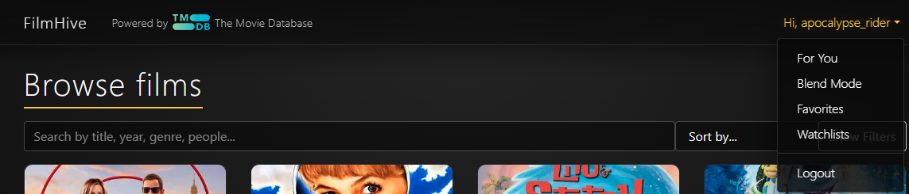

2. **User Experience & Design:**
   - All navigation items feature **hover effects** for better interactivity.
   - Active page is highlighted with visual indicators.
   - **Responsive design** with mobile-friendly toggle menu.
   - Smooth transitions between pages without browser "Back" button dependency.

   

__Home Page__

The Home page serves as the entry point, welcoming users and showcasing the platform's key features.

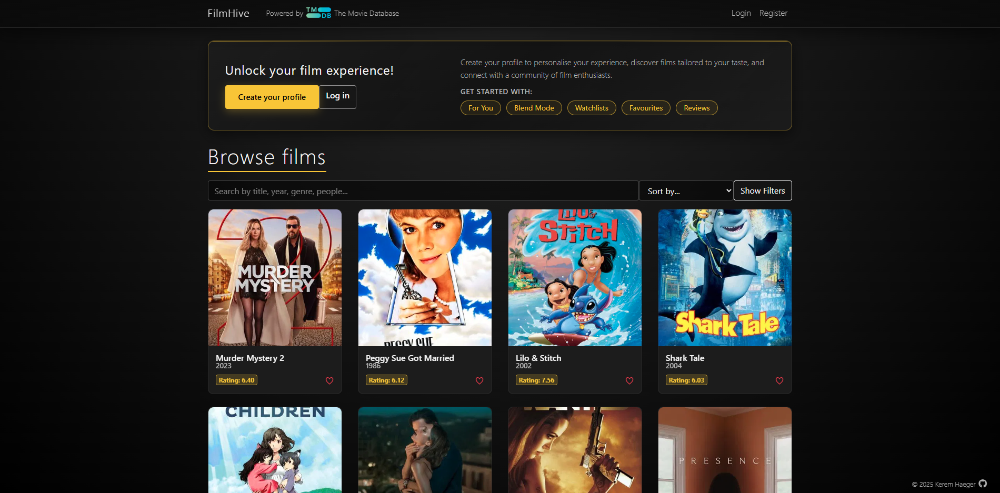

1. **Hero Section:**
   - Compelling headline and description.
   - Call-to-action buttons for Sign Up / Sign In (non-authenticated users).
   - Direct access to browse films.

2. **Feature Highlights:**
   - **Film Discovery** – Browse thousands of films.
   - **Reviews & Ratings** – Share and read community opinions.
   - **Watchlists** – Organize films you plan to watch.
   - **Blend Mode** – Find films for couples and groups.
   - **Personalized Recommendations** – Tailored suggestions.

3. **Visual Design:**
   - Hero image showcasing film content.
   - Hover effects on interactive elements.
   - Responsive layout adapting to all screen sizes.

__Log In Page__

Registered users can securely access their accounts through the Sign In page.

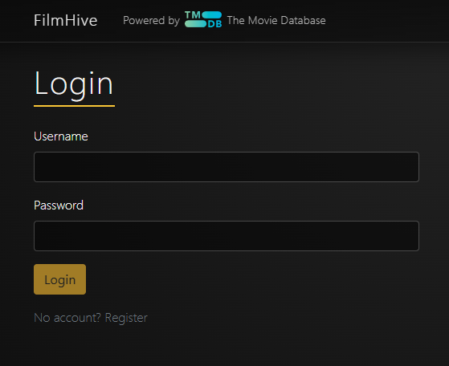

1. **Authentication Form:**
   - **Username** field
   - **Password** field
   - **Login** button with hover effect
   - Link to **Register** for new users

2. **Error Handling:**
   - Clear error messages for invalid credentials
   - Field validation feedback
   - Network error handling

3. **User Experience:**
   - Remember me functionality (token-based)
   - Secure session management
   - Redirect to previous page after successful login

__Register Page__

New users can create accounts through the registration form.

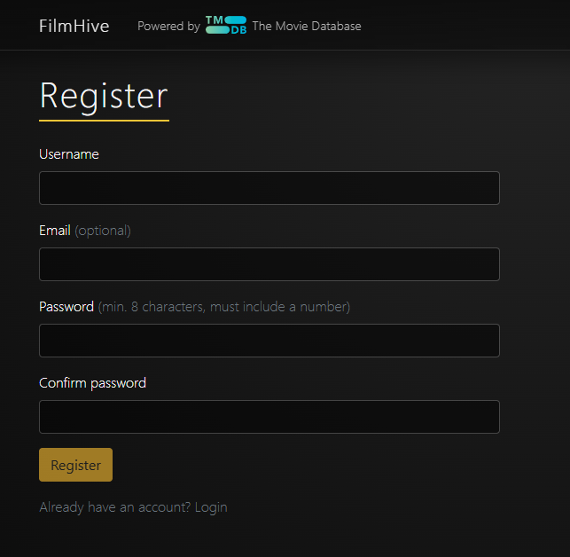

1. **Registration Form:**
   - **Username** (required, unique)
   - **Email** (optional, valid format)
   - **Password** (required, minimum security requirements)
   - **Confirm Password** (must match)

2. **Validation:**
   - Real-time field validation
   - Clear error messages
   - Password strength indicators
   - Duplicate username/email prevention

3. **User Flow:**
   - Link to **Login** for existing users
   - Automatic login after registration

__Films Page__

The main browsing interface for discovering and exploring films. This is the same page as the Home Page, but without the CTA for authenticated users.

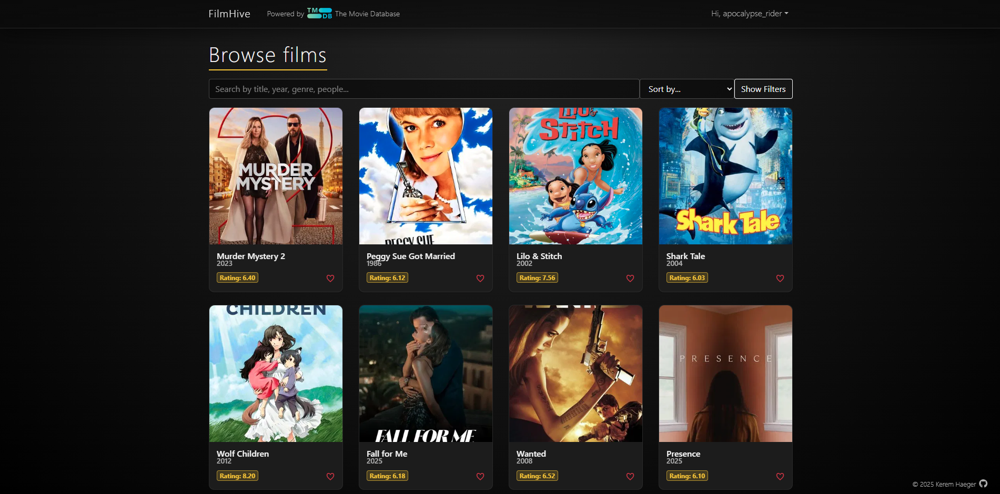

1. **Film Display:**
   - **Grid layout** on larger screens
   - **List/card view** on mobile devices
   - Film posters with hover effects
   - Title, year, and rating displayed
   - Immediate option to favourite a film without having to click on it

2. **Search Functionality:**
   - **Search bar** with real-time filtering
   - Search by film title, genre, keyword, person, etc
   - Clear button to reset search
   - Search persistence across page navigation

   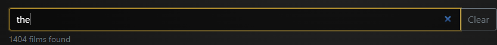

3. **Filter Controls:**
   - **Genre filter** (dropdown with multiple selection)
   - **Year range** filter
   - **Rating filter** Highest or Lowest first
   - **Popularity** (descending)
   - **Show/Hide Filters** toggle button
   - **Clear All Filters** button (only when at least one filter selected)

   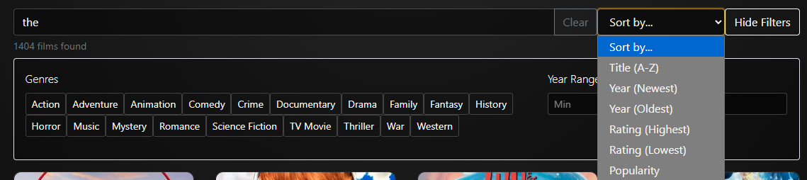

4. **Infinite Scrolling:**
   - Automatic loading of additional films
   - Loading spinner during data fetch
   - Smooth scroll experience
   - Performance optimized for large datasets

5. **Film Card Actions:**
   - Click anywhere on card to view details
   - **Favorite button** (heart icon) for quick favoriting
   - Visual indication of favorited films
   - Hover effects for interactivity

   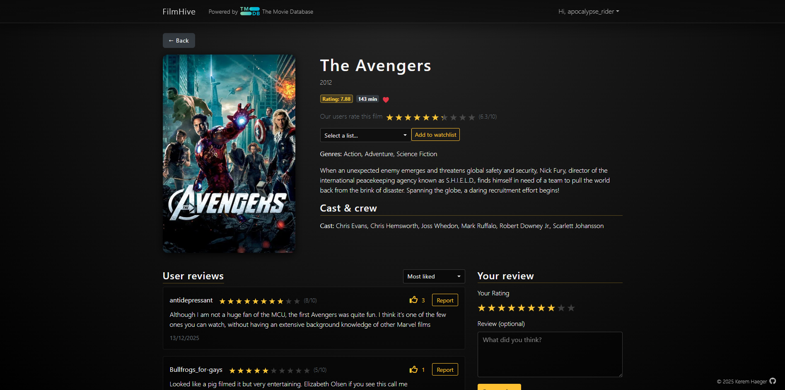

__Film Detail Page__

Comprehensive view of individual film information.


1. **Film Information:**
   - **Large poster image**
   - **Title and release year**
   - **Genre tags** (clickable)
   - **Average user rating** (star display)
   - **Synopsis/Plot** description
   - **Runtime** and other metadata

2. **Cast & Crew Section:**
   - **Main cast** members

3. **User Actions:**
   - **Add to Favorites** button
   - **Add to Watchlist** dropdown (can create a new watchlist right there)
   - **Write a Review** button

4. **Reviews Section:**
   - List of all reviews for the film
   - Own review always on top if present
   - **Sort options**: Newest, Highest rated
   - User ratings
   - Review text and timestamps
   - Edit/delete options for user's own reviews

5. **Review Form:**
   - **Star rating** selector (1-10 stars)
   - **Text area** for written review
   - **Submit** and **Cancel** buttons
   - Validation for required fields
   - Success notification on submission

__Favorites Page__

Personal collection of favorited films.

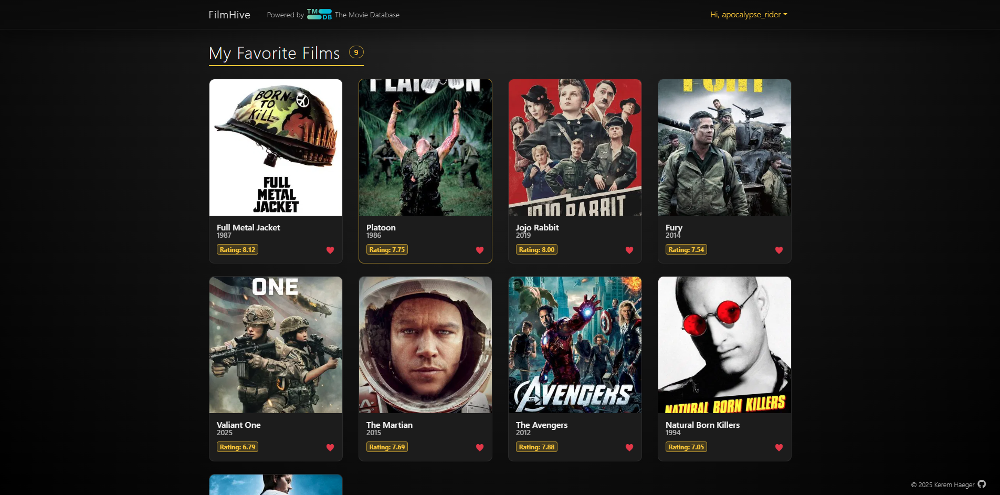

1. **Display:**
   - Grid/list layout of favorited films
   - Same card design as main Films page
   - Quick unfavorite action
   - Empty state message if no favorites

2. **Features:**
   - Remove from favorites
   - Navigate to film details

__Watchlists Page__

Manage and organize personal watchlists.

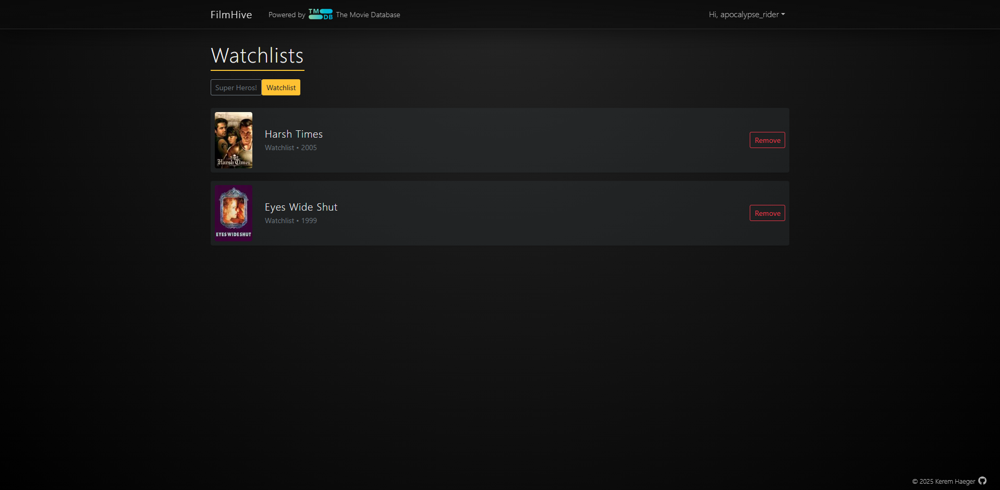

1. **Watchlist Overview:**
   - List of all user's watchlists
   - Watchlist name - can toggle between watchlists
   - Delete option for films on watchlist

__Blend Mode Page__

Unique feature for finding "compromise" films.

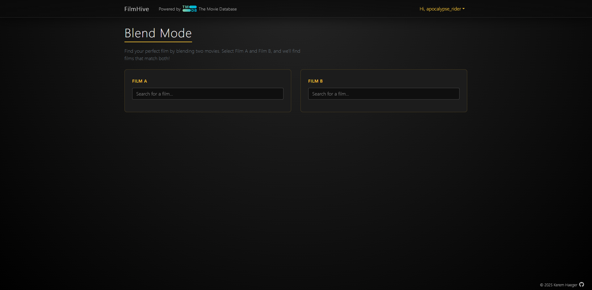
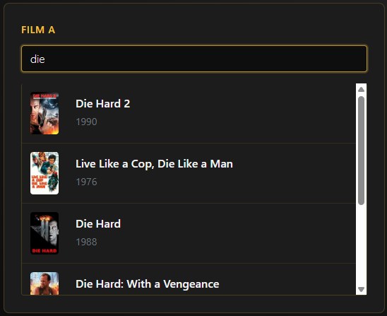
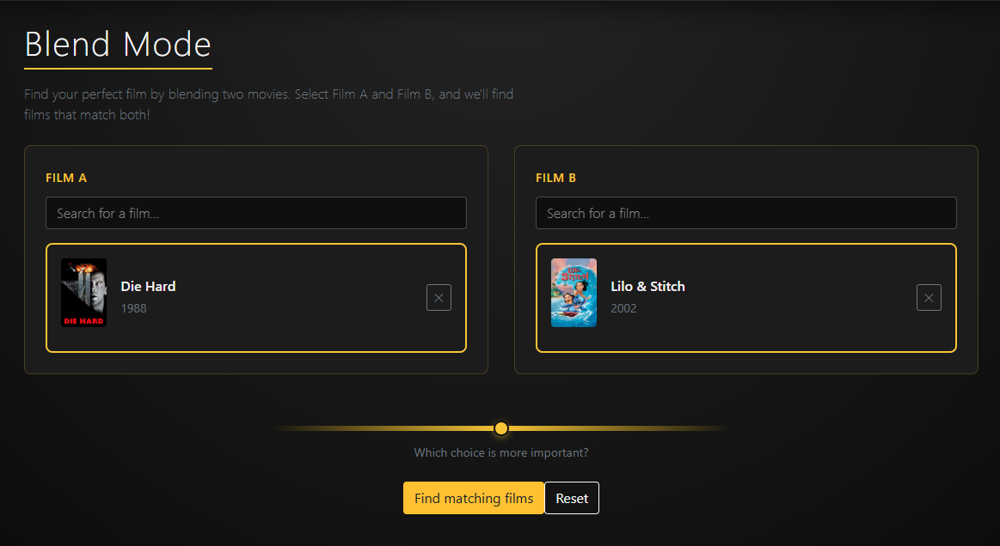
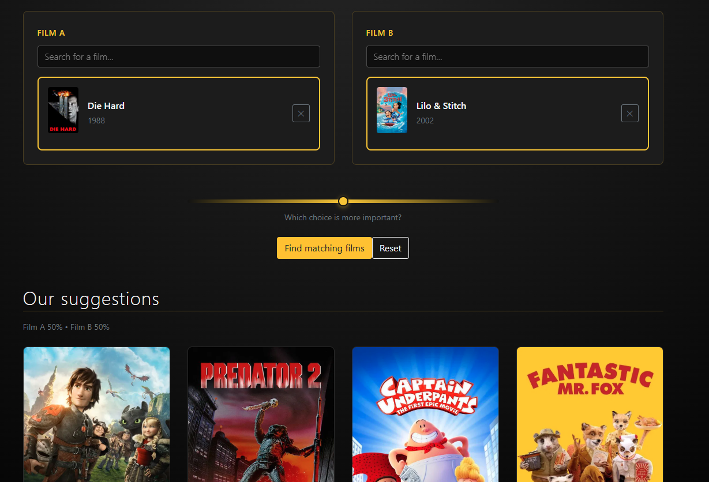

1. **User Selection:**
   - **Search for film** input field
   - Film suggestions dropdown
   - Clear selection option

2. **Algorithm:**
   - Analyzes both film's attributes
   - Finds common genres and themes
   - Suggests films with high compatibility
   - Weighted scoring system
   - User can favour one or the other film via a slider

3. **Results Display:**
   - **Compromise films** grid
   - **Compatibility score** indicator
   - Film cards with standard information
   - Explanation of why film was suggested

__For You Page__

Personalized recommendations based on user preferences.


1. **Recommendation Engine:**
   - Analyzes user's favorites
   - Considers rating history
   - Factors in genre preferences

2. **Display:**
   - Curated selection of recommended films
   - **Recommendation reason** (e.g., "Because you liked...")
   - Standard film card layout

3. **User Actions:**
   - Favorite recommended films
   - Add to watchlists
   - View film details

__Notifications__

Real-time feedback system for user actions.

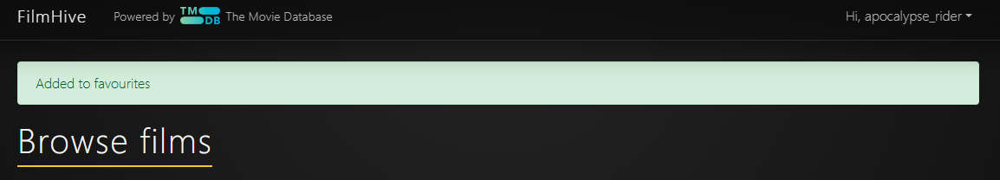
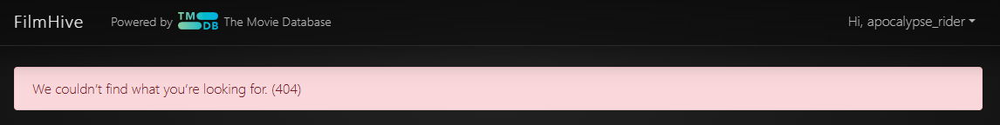


1. **Types:**
   - **Success** notifications (green)
   - **Error** notifications (red)
   - **Info** notifications (blue)
   - **Warning** notifications (yellow)

2. **Behavior:**
   - Auto-dismiss after 5 seconds
   - Manual dismiss option
   - Stack multiple notifications

3. **Common Messages:**
   - "Film added to favorites"
   - "Review submitted successfully"
   - "Watchlist created"
   - Error messages for failed operations

### Future Features

- **Social Features:** Follow other users, share watchlists publicly
- **Log in** with email OR username
- **Safeguarding:** In addition to reporting reviews, give a reason, have admin feedback and decisions
- **Advanced Filters:** Streaming service availability, language, subtitles
- **Lists & Collections:** Themed collections, trending lists, new or coming soon, etc
- **Recommendation Improvements:** Machine learning-based suggestions
- **Actor/Director Pages:** Detailed pages for cast and crew
- **Similar Films:** "If you liked this" suggestions
- **User Badges:** Achievement system for active users
 
## Technologies Used

### Frontend

- React 17.0.2
- react-dom 17.0.2
- React Router DOM 6.30.2
- Axios 1.6.7
- Bootstrap 4.6.2 / React Bootstrap 1.6.5
- react-star-ratings 2.3.0
- web-vitals 1.1.2
- Express 4.22.1 (serves the production build)

### Backend (API consumed by this frontend)

- Django 4.2
- Django REST Framework
- dj-rest-auth
- SimpleJWT
- PostgreSQL

### External Services

- TMDB API (film metadata)

## Deployment

The FilmHive frontend is deployed to Heroku using the web interface. 
The live link can be found here: [FimHive](https://filmhive-85b95f07d5b8.herokuapp.com/)

For detailed instructions on Deployment, please see [DEPLOYMENT.md](DEPLOYMENT.md)

> **Note:**  
> A small number of test user accounts and reviews have been intentionally left in the deployed database to demonstrate review creation, permissions, and aggregation behaviour.  
> Reviews are primarily associated with a limited set of films (e.g. *The Avengers*) to make assessment and testing clearer.


### Prerequisites
- Heroku account
- Git installed locally
- Node.js and npm installed

## Architecture & Code Structure

### Component Organization
```
src/
├── components/                    # Reusable UI components
│   ├── BlendModeSearch.js        # Blend mode search functionality
│   ├── CompromiseFilmCard.js     # Film card for blend mode results
│   ├── FavoriteButton.js         # Favorite toggle button
│   ├── FilmCard.js               # Standard film card component
│   ├── Layout.js                 # App layout wrapper
│   ├── MainNavbar.js             # Main navigation bar
│   ├── Navbar.js                 # Navigation component
│   ├── __tests__/                # Component tests
│   │   ├── FavoriteButton.test.js
│   │   └── FilmCard.test.js
│   ├── common/                   # Shared/common components
│   │   ├── AuthCtaBanner.js      # Authentication call-to-action banner
│   │   └── NotificationAlert.js  # Notification alert display
│   ├── film/                     # Film detail page components
│   │   ├── CastCrewSection.js    # Cast and crew listing
│   │   └── FilmHeader.js         # Film header with title, poster, rating
│   ├── films/                    # Films list page components
│   │   ├── SearchBar.js          # Film search input
│   │   ├── SortControl.js        # Sort dropdown control
│   │   └── __tests__/
│   │       └── SearchBar.test.js
│   ├── filters/                  # Filter controls
│   │   └── FilterBar.js          # Genre/year filter controls
│   └── reviews/                  # Review components
│       ├── ReviewForm.js         # Review creation/edit form
│       ├── ReviewItem.js         # Individual review display
│       └── ReviewsList.js        # Reviews list container
├── context/                       # React Context providers
│   ├── AuthContext.js            # Authentication state
│   ├── FavoritesContext.js       # Favorites state management
│   ├── NotificationContext.js    # Global notifications state
│   └── WatchlistsContext.js      # Watchlists state management
├── hooks/                         # Custom React hooks
│   ├── useBlendMode.js           # Blend mode logic
│   ├── useFavorites.js           # Favorites functionality
│   ├── useFilmDetails.js         # Film detail fetching
│   ├── useFilmFilters.js         # Filter state management
│   ├── useFilmSearch.js          # Search functionality
│   ├── useInfiniteScroll.js      # Infinite scroll logic
│   ├── useNotification.js        # Notification helpers
│   ├── useReviewForm.js          # Review form state
│   ├── useReviews.js             # Review CRUD operations
│   └── useWatchlists.js          # Watchlist management
├── pages/                         # Page-level components
│   ├── BlendModePage.js          # Blend mode page
│   ├── BlendModePage.css         # Blend mode styling
│   ├── FavoritesPage.js          # Favorites page
│   ├── FilmDetailPage.js         # Film detail page
│   ├── FilmsPage.js              # Films browsing page
│   ├── ForYouPage.js             # Personalized recommendations page
│   ├── LoginPage.js              # Login page
│   ├── RegisterPage.js           # Registration page
│   └── WatchlistsPage.js         # Watchlists management page
├── services/                      # API service layers
│   ├── api.js                    # Axios instance & base configuration
│   ├── filmService.js            # Film-related API calls
│   └── reviewService.js          # Review-related API calls
├── utils/                         # Utility functions and constants
│   ├── constants.js              # App constants and configuration
│   ├── errorUtils.js             # Error handling utilities
│   └── imageUtils.js             # Image processing utilities
├── App.js                         # Root app component
├── App.css                        # App-level styles
├── index.js                       # React entry point
└── index.css                      # Global styles
```
---

## Design Decisions & Justification (Distinction)

### Authentication Strategy – JWT

**JWT authentication** was chosen over session-based authentication because:

- It supports a clean separation between React frontend and Django REST backend
- Tokens can be securely stored and reused across page refreshes
- It simplifies protected route handling on the frontend
- It aligns with modern SPA best practices

This approach also supports future extensibility (e.g. mobile clients) without changing authentication logic.

---

### State Management – React + Context

FilmHive uses **React state and context** with Axios for data fetching:

- Local component state for view-level UI concerns (inputs, modals, filters)
- Contexts/hooks (e.g., auth, notifications) for cross-cutting app state
- Axios handles server requests; responses update component or context state

This keeps the stack lightweight and aligned with what is actually installed.

---

### Film Data Strategy – Hybrid TMDB Caching

FilmHive uses a **hybrid data strategy**:

- Film metadata is sourced from the **TMDB API**
- Data is cached locally in the backend database when accessed

This approach was chosen to:

- Avoid repeated external API calls
- Improve response times for commonly accessed films
- Allow relational features (reviews, favourites, watchlists)
- Maintain data consistency across users

This also supports a controlled **seed strategy**, ensuring the platform is populated with meaningful data while avoiding unnecessary bloat.

---

## Data Flow & Architecture

### High-Level Flow

1. React frontend requests data via Axios
2. Django REST API processes requests
3. JWT middleware validates authentication (if required)
4. Database handles relational user interactions
5. React components/contexts update UI state based on API responses

### Key Principles

- **Thin frontend, authoritative backend**
- **One review per user per film enforced server-side**
- **Optimistic UI updates with rollback on failure**
- **Graceful error handling and retry mechanisms**

This architecture ensures data integrity while keeping the user experience responsive.

---

## Accessibility Considerations

Accessibility was considered throughout development and validated using **Lighthouse audits**.

Implemented features include:

- Full **keyboard navigation** across interactive elements
- **Visible focus states** for buttons and links
- Semantic HTML structure (proper use of buttons, labels, headings)
- Meaningful **alt text** for images
- Colour contrast checks with no Lighthouse flags raised

The application achieves an **accessibility score of ~81**, which reflects intentional effort within MVP scope, with room for improvement in future iterations.

---

### Key Architectural Patterns

**Context API for State Management**
- `AuthContext` - User authentication state
- `FavoritesContext` - Favorite films management
- `WatchlistsContext` - Watchlist management
- `NotificationContext` - Global notifications

**Custom Hooks**
- `useFilmSearch` - Search and filter logic
- `useFilmFilters` - Filter state management
- `useInfiniteScroll` - Infinite scrolling implementation
- `useFavorites` - Favorite actions
- `useReviews` - Review CRUD operations
- `useWatchlists` - Watchlist management
- `useBlendMode` - Blend mode algorithm

**Service Layer**
- `api.js` - Axios configuration and interceptors
- `filmService.js` - Film-related API calls
- `reviewService.js` - Review API endpoints

## Future Improvements

- **Social Features**: User following, public profiles, shared watchlists
- **Advanced Recommendations**: Machine learning-based personalization
- **Streaming Integration**: Direct links to streaming services
- **Mobile App**: Native iOS and Android applications
- **Discussion Forums**: Film discussion boards and threads
- **Watch Together**: Virtual watch party feature
- **Actor/Director Pages**: Detailed filmography pages
- **List Collections**: Public themed lists and rankings
- **Multi-language Support**: Internationalization (i18n)
- **Accessibility**: WCAG 2.1 AA compliance
- **Performance**: Progressive Web App (PWA) features
- **Analytics**: User behavior tracking and insights

## Credits 

### Technologies & Frameworks
- **[React](https://react.dev/)** - Frontend JavaScript library for building the user interface
- **[React Router](https://reactrouter.com/)** - Client-side routing solution
- **[Bootstrap](https://getbootstrap.com/)** - CSS framework for responsive design
- **[React Bootstrap](https://react-bootstrap.github.io/)** - React components for Bootstrap
- **[Axios](https://axios-http.com/)** - Promise-based HTTP client
- **[Heroku](https://www.heroku.com/)** - Cloud platform for deployment
- **[Express.js](https://expressjs.com/)** - Minimal Node.js web server
- **[GitHub](https://github.com/)** - Version control and repository hosting

### Film Data
- **[The Movie Database (TMDb)](https://www.themoviedb.org/)** - Film information, posters, and metadata

### Design Resources
- **[Font Awesome](https://fontawesome.com/)** - Icons for UI elements
- **Bootstrap default font stack** - System fonts, no external font CDN
- Favicon: created by BZZRINCANTATION

### Learning Resources
- **[React Documentation](https://react.dev/)** - Official React guides and tutorials
- **[MDN Web Docs](https://developer.mozilla.org/)** - Web development documentation
- **[Stack Overflow](https://stackoverflow.com/)** - Community support and problem-solving

### Code & Inspiration
- **[Code Institute](https://codeinstitute.net/)** - Educational foundation and project guidance
- Film review platforms for feature inspiration (Letterboxd, IMDb, Rotten Tomatoes)

### Acknowledgments

- [Juliia Konovalova](https://github.com/IuliiaKonovalova/) for the mentor support and advice
- My partner Saskia for rigorouly testing the app and criticising me

---

**Note**: This is a frontend application that requires a backend API to function fully. Please refer to the backend repository for API documentation and setup instructions.

Made with ❤️ for film lovers everywhere.