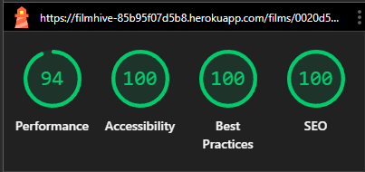
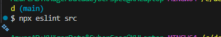
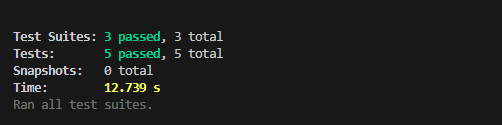

## TESTING (FilmHive)

### Purpose of Testing

The purpose of testing is to ensure FilmHive works correctly, has no critical errors, and provides a smooth experience for both guest users (browse/search) and authenticated users (reviews, review likes, favourites, watchlists, For You recommendations, Blend Mode).

---

## Functional Testing

Functional testing ensures that all features and functionalities of the application work as expected, regardless of the device or screen size.

Legend:
- Tested: Y/N
- Passed: Y/N

| Feature | Action | Expected Result | Tested | Passed | Comments |
|---|---|---|---|---|---|
| **Navigation / Layout** |||||| 
| Navbar visibility | Open multiple pages | Navbar is visible on all pages | Y | Y | |
| Logo | Click logo | Redirects to Films page (root) | Y | Y | |
| Films link | Click "Films" | Opens Films listing page | Y | Y | |
| Blend Mode link (auth-only) | Logged out: check navbar | Link is hidden when logged out | Y | Y | |
| Blend Mode link (auth-only) | Logged in: click link | Opens Blend Mode page | Y | Y | |
| For You link (auth-only) | Logged out: check navbar | Link is hidden when logged out | Y | Y | |
| For You link (auth-only) | Logged in: click link | Opens For You (recommendations) page | Y | Y | |
| Favourites link (auth-only) | Logged in: click Favourites | Opens Favourites page | Y | Y | |
| Watchlists link (auth-only) | Logged in: click Watchlists | Opens Watchlists page | Y | Y | |
| Login/Register links (guest-only) | Logged out: check navbar | Login/Register are visible | Y | Y | |
| Logout (auth-only) | Click Logout | User logged out and redirected to Films page | Y | Y | |
| Active nav highlighting | Navigate pages | Current page is visually highlighted | Y | Y | |
| Mobile menu toggle | Mobile width: open menu | Menu expands/collapses correctly | Y | Y | |


| Feature | Action | Expected Result | Tested | Passed | Comments |
|---|---|---|---|---|---|
| **Films Listing (Browse/Search/Filter/Sort)** |||||| 
| Films list loads | Open Films page | Films render (with loading state) | Y | Y | |
| Search by title | Enter query | Results match query | Y | Y | |
| Filter: genre | Choose a genre | Results update to matching films | Y | Y | |
| Filter: year | Apply year (or range) | Results update correctly | Y | Y | |
| Sort options | Change sort order | Results sorted correctly | Y | Y | |
| Clear filters | Click "Clear filters" | Filters reset, list returns to default | Y | Y | |
| Empty results | Apply restrictive filters | "No results found" message displayed | Y | Y | |
| Infinite scroll | Load more | More films load without breaking layout | Y | Y | |

| Feature | Action | Expected Result | Tested | Passed | Comments |
|---|---|---|---|---|---|
| **Film Detail Page (UUID-based)** |||||| 
| Detail page loads | Open film detail by UUID | Film details render | Y | Y | |
| Film metadata | View details | Poster/title/year/runtime/genres display correctly | Y | Y | |
| Cast & crew section | View details | Cast and crew information displays | Y | Y | |
| Reviews list | Scroll reviews area | Reviews render for that film | Y | Y | |
| Guest restrictions | Logged out: attempt review actions | Cannot create/edit/delete/like; prompt to login | Y | Y | |
| Error handling: invalid UUID | Open non-existent UUID | Friendly "Not found" page/message | Y | Y | |

| Feature | Action | Expected Result | Tested | Passed | Comments |
|---|---|---|---|---|---|
| **Authentication** |||||| 
| Register (valid) | Submit valid details | Account created; user can login | Y | Y | |
| Register (invalid) | Submit invalid fields | Validation messages shown; no crash | Y | Y | |
| Login (valid) | Correct credentials | Login success; authenticated UI visible | Y | Y | |
| Login (invalid) | Wrong credentials | Clear error message shown | Y | Y | |
| Logout | Click logout | Auth cleared; protected pages blocked | Y | Y | |
| Protected routes | Direct-open auth-only pages | Redirect to Login with redirect-back functionality | Y | Y | |
| Auth method behaviour | Login/logout across refresh | Auth persists as designed (JWT-based authentication) | Y | Y | |


| Feature | Action | Expected Result | Tested | Passed | Comments |
|---|---|---|---|---|---|
| **Favourites** |||||| 
| Favourites page loads | Open Favourites page | User's favourite films display in grid | Y | Y | |
| Add favourite | Click "Favourite" button | Favourite is created and UI updates | Y | Y | |
| Remove favourite | Click favourite button again | Favourite removed and UI updates | Y | Y | |
| Prevent duplicates | Favourite same film twice | Duplicate prevented (unique user+film) | Y | Y | |
| Persist after refresh | Refresh page | Favourite state persists | Y | Y | |
| Empty state | No favourites | Friendly message with link to browse films | Y | Y | |

| Feature | Action | Expected Result | Tested | Passed | Comments |
|---|---|---|---|---|---|
| **Watchlists (Multiple lists; list disappears when empty)** |||||| 
| Watchlists page loads | Open Watchlists page | User's watchlists display grouped by list name | Y | Y | |
| Toggle between lists | Click list name tabs | Display switches to selected list | Y | Y | |
| Add to watchlist | Add film with list_name | Entry created and shown under that list_name | Y | Y | |
| Add same film to different list | Add film with another list_name | Allowed; film appears in both lists | Y | Y | |
| Prevent duplicates in same list | Add same film to same list_name | Duplicate prevented (unique user+film+list_name) | Y | Y | |
| Remove film from list | Remove watchlist item | Item removed and UI updates | Y | Y | |
| List auto-deletes when empty | Remove last item in a list_name | That list_name no longer appears in UI | Y | Y | |
| Persist after refresh | Refresh page | Watchlists persist correctly | Y | Y | |
| Empty state | No watchlists | Friendly message with link to browse films | Y | Y | |

| Feature | Action | Expected Result | Tested | Passed | Comments |
|---|---|---|---|---|---|
| **Reviews (CRUD) & Review Likes** |||||| 
| Create review | Submit rating + text | Review created and displayed under film | Y | Y | |
| Validation: rating | Submit invalid rating | Validation error shown | Y | Y | |
| Edit review (owner only) | Edit your review | Review updated | Y | Y | |
| Delete review (owner only) | Delete your review | Review removed | Y | Y | |
| One review per film | Try second review on same film | Blocked (unique user+film) with message | Y | Y | |
| Review sorting | Change sort order | Reviews sorted by likes or date | Y | Y | |
| Like a review | Click "Helpful/Like" | Like created and count increments | Y | Y | |
| Unlike a review | Click again | Like removed and count decrements | Y | Y | |
| Prevent duplicate likes | Like same review twice | Duplicate prevented (unique user+review) | Y | Y | |
| Auth restriction | Logged out: like review | Blocked; prompt to login | Y | Y | |

| Feature | Action | Expected Result | Tested | Passed | Comments |
|---|---|---|---|---|---|
| **For You - Personalized Recommendations (Auth-only)** |||||| 
| For You page loads | Open For You page | List renders with loading state then results | Y | Y | |
| Auth restriction | Logged out: open For You | Redirect/prompt to login | Y | Y | |
| Uses user data | Add favourites/reviews then reload | Recommendations reflect user tastes (at least partially) | Y | Y | |
| Infinite scroll | Scroll to bottom | More recommendations load | Y | Y | |

| Feature | Action | Expected Result | Tested | Passed | Comments |
|---|---|---|---|---|---|
| **Blend Mode (Auth-only)** |||||| 
| Open Blend Mode | Navigate to Blend Mode | Page loads and shows UI to search and pick two films | Y | Y | |
| Search for films | Type in search boxes | Film suggestions appear in dropdown | Y | Y | |
| Pick two films | Select film A and film B | Films displayed with clear selection | Y | Y | |
| Get recommendations | Click submit | Compromise/blend results returned with match scores | Y | Y | |
| Weighting control | Change weighting slider | Results update accordingly based on preferences | Y | Y | |
| Clear selections | Click reset or X buttons | Selections cleared and can start over | Y | Y | |
| Auth restriction | Logged out: open Blend Mode | Redirect/prompt to login | Y | Y | |

| Feature | Action | Expected Result | Tested | Passed | Comments |
|---|---|---|---|---|---|
| **Error Handling & UX Feedback** |||||| 
| Loading states | Trigger API calls | Spinner/skeleton shown; no layout jump | Y | Y | |
| API error | Simulate 500/timeout | Friendly error shown; retry possible | Y | Y | |
| Form errors | Submit invalid forms | Inline validation; no crash | Y | Y | |
| Unauthorized (401/403) | Access auth-only endpoint | Redirect/prompt to login | Y | Y | |
| Success notifications | Complete actions | Success message displays briefly | Y | Y | |

---

## Testing User Stories

### First-time visitors (Guest)

| ID | Test Case | Expected Outcome |
|---|---|---|
| US01 | Browse films without login | Guests can view Films listing and Film detail pages in read-only mode. |
| US02 | Search and filter films | Guests can search by title and use filters/sort to narrow results. |
| US03 | Read reviews | Guests can read reviews but cannot create/edit/delete/like reviews. |

### Returning users (Authenticated)

| ID | Test Case | Expected Outcome |
|---|---|---|
| US04 | Auth flow | Users can register/login/logout; protected features are blocked for guests. |
| US05 | Manage favourites | Users can add/remove favourites; duplicates are prevented; state persists. |
| US06 | Manage watchlists (multi-list) | Users can add films to multiple named lists; duplicates prevented per list; a list disappears when empty. |
| US07 | Review CRUD | Users can create/edit/delete their reviews; only one review per film. |
| US08 | Like reviews | Users can like/unlike reviews; duplicates prevented; like count updates correctly. |
| US09 | For You - Personal recommendations | Auth users can view personalized film recommendations influenced by their favourites/reviews. |
| US10 | Blend Mode | Auth users can pick two films and receive compromise/blend suggestions with match scores. |

---

## Performance Testing

Use Lighthouse to test performance, accessibility, best practices, and SEO.




---

## User Interface Testing

### Responsive Testing


### Cross-browser Testing

Test minimum:
- Chrome
- Firefox
- Safari

---

## Validation

### JavaScript Quality Validation (ESLint)

The frontend codebase was checked using **ESLint** to ensure code quality, consistency, and adherence to best practices.



#### Running ESLint
The following command was used:
```bash
npx eslint src
```

#### Results
- ESLint completed successfully with **no errors or warnings**.
- No rule overrides or fixes were required.

---

## Automated Testing

FilmHive uses **Jest** and **React Testing Library** for automated component testing.



### Test Framework
- **Jest** - JavaScript testing framework
- **React Testing Library** - React component testing utilities
- **@testing-library/user-event** - User interaction simulation
- **@testing-library/jest-dom** - Custom Jest matchers for DOM assertions

### Running Tests

```bash
# Run all tests
npm test

# Run tests in watch mode (default)
npm test -- --watch

# Run tests with coverage
npm test -- --coverage

# Run tests once (CI mode)
npm test -- --watchAll=false
```

### Existing Test Suites

#### 1. **FavoriteButton Component Tests**
Location: `src/components/__tests__/FavoriteButton.test.js`

**Test Cases:**
- ✅ Shows login tooltip and prevents toggling when user is unauthenticated
- ✅ Calls toggleFavorite function when authenticated user clicks button
- ✅ Verifies auth-restricted functionality works correctly

**What's Tested:**
- Authentication state handling
- Context integration (AuthContext, FavoritesContext)
- User interaction with tooltips
- Favorite toggle functionality
- ARIA labels for accessibility

---

#### 2. **FilmCard Component Tests**
Location: `src/components/__tests__/FilmCard.test.js`

**Test Cases:**
- ✅ Renders film title, year, and metadata correctly
- ✅ Displays rating badge with proper formatting (2 decimals)
- ✅ Shows match score badge (rounded to nearest percent)
- ✅ Renders film reasons/tags correctly
- ✅ Includes FavoriteButton component
- ✅ Displays poster image with correct alt text

**What's Tested:**
- Component rendering with mock data
- Integration with React Router (MemoryRouter)
- Context providers (Auth and Favorites)
- Data formatting and display
- Image handling with alt text

---

#### 3. **SearchBar Component Tests**
Location: `src/components/films/__tests__/SearchBar.test.js`

**Test Cases:**
- ✅ Shows Clear button when search term is present
- ✅ Calls onClear callback when Clear button is clicked
- ✅ Displays result count with correct pluralization (1 film vs 3 films)
- ✅ Shows result hint text accurately

**What's Tested:**
- Conditional rendering (Clear button visibility)
- User interaction (button clicks)
- Event handler callbacks
- Text pluralization logic
- Result count display

---

### Test Coverage

Current test coverage includes:
- **UI Components**: FavoriteButton, FilmCard, SearchBar
- **User Interactions**: Click events, form inputs
- **Authentication**: Auth state handling, protected features
- **Context API**: AuthContext, FavoritesContext integration
- **Routing**: React Router integration
- **Data Display**: Formatting, badges, images, metadata

### Future Testing Recommendations

Consider adding automated tests for:
- Review form submission and validation
- Film filtering and sorting logic
- Watchlist management functionality
- Error handling and loading states
- Blend Mode search and selection
- API service layer (unit tests with mocked axios)
- Custom hooks (useFilmSearch, useFilmFilters, useInfiniteScroll, etc.)
- Integration tests for complete user flows

### Notes
- All tests use mocked API calls to avoid ESM issues with axios in Jest
- Tests include proper accessibility checks (ARIA labels, roles)
- Components are tested with necessary context providers
- React Router components wrapped in MemoryRouter for testing

